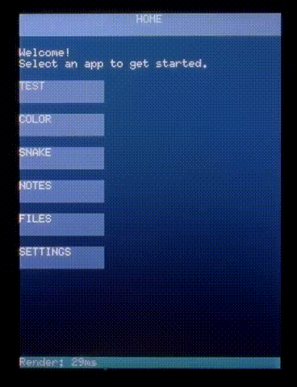

# Pocket Computer (ESP32-S3)

A pocket computer inspired by **Palm OS–style devices**, built on a **LilyGo T-HMI (ESP32-S3 + touchscreen)**.

Exploring fast, simple, and responsive computing on embedded hardware using Rust.

## Why?
Modern devices are powerful, but often complex and distracting.

This project explores a different direction, bringing back simplicity and immediacy in computing:

- A **focused, single-purpose device**
- Fast, responsive UI without unnecessary overhead
- Simple, app-style interaction model
- Full control over rendering, input, and storage

It also serves as a playground for:

- Embedded UI systems
- Lightweight OS/app architecture
- Custom storage systems (mem-fs)

## Features
- Rust (`no_std`)
- Custom grid-based screen model
- Dirty rendering (incremental updates)
- Touch input + on-screen buttons
- Multi-app system with launcher
- System UI (title bar, status bar)
- Integrated **mem-fs**
- **Apps**
	- Home/Launcher
	- Color Picker
	- Snake
	- Notes
	- Files
	- Settings

## Storage (mem-fs)
The system uses [`mem-fs`](https://github.com/wesselfr/mem-fs), a custom in-memory filesystem designed for embedded systems.

- Zero-copy file access
- Deterministic memory usage
- Fast read/write operations
- Designed for tight integration with the UI and apps

Persistent storage (flash) is supported, allowing data to persist across reboots.

## Performance
The UI originally used full-screen redraws (~200ms per update). The renderer was reworked to use dirty cell tracking and incremental updates.

Typical timings now:

- Full screen clear: ~30–40ms
- Normal UI updates: ~8–15ms

This significantly improves input responsiveness.

## Hardware / Stack
- LilyGo T-HMI
- ESP32-S3
- ST7789 LCD
- Rust (`no_std`)
- `embedded-graphics`, `mipidsi`
- Custom rendering + input system
- mem-fs (in-memory filesystem)

## Roadmap

### In progress
- File browser app
- Notes / text app
- Keyboard input (on-screen)

### Next
- Additional games (Breakout, etc.)
- DMA-backed graphics backend
- Power management improvements

### Completed
- mem-fs integration
- Persistent storage (flash)